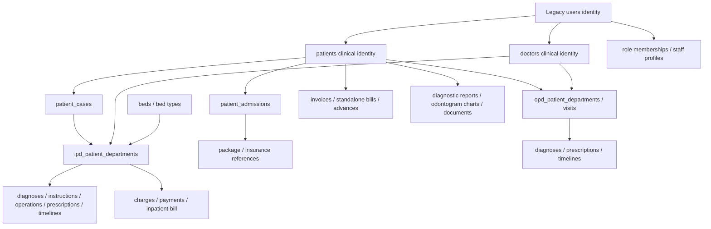

# Database design and relation map

## Complete schema artifacts

The full original schema is supplied in [TABLES.md](../legacy-schema/TABLES.md) and [original-mysql-schema.sql](../legacy-schema/original-mysql-schema.sql), not abbreviated to the diagram below. The SQL contains schema statements, not patient/staff data. [foreign-keys.csv](../legacy-schema/foreign-keys.csv) records every extracted foreign key and action. [inventory.json](../legacy-schema/inventory.json) includes model relationships, casts/constants and migration provenance. [MIGRATIONS.md](../legacy-schema/MIGRATIONS.md) records changes beyond the dump.

There are 141 dump tables and 1,202 columns. Dump and migration history disagree in places; inspect [reconciliation](../legacy-schema/migration-reconciliation.json). A target with a similar number of tables is not equivalent. The checked-in PostgreSQL history had 48 migrations at this checkpoint; the public development database was previously observed at 046. Inspect the actual migration ledger before applying anything.

## Conceptual relationships

This is conceptual, not an exhaustive physical ERD. Use the FK export and model relations for exact key names, cardinalities and polymorphic links.

## Identity and permissions

Legacy `users.id`, `patients.id` and `doctors.id` are different keys. Role-specific tables reference user identities. Target staff user text IDs and patient UUIDs must be mapped explicitly; never pass one because a selector labels both “patient” or “doctor”. Maintain a deterministic import map keyed by legacy table and ID, not ID alone.

Legacy `departments` means Spatie roles under the source permission configuration. `doctor_departments` means clinical departments. `model_has_roles`, `model_has_permissions`, `role_has_permissions` and `permissions` permit associations that a single fixed target role may not represent. Decide multi-role and per-user overrides; do not claim equivalence based on nine role names.

Addresses, media owners and payroll ownership use polymorphic type/ID relationships. Enumerate supported owner types and authorize through the actual parent. A UUID-like file reference is not permission. Laravel reset/session/token/password data must not be blindly imported into Better Auth; plan invitation/reset and invalidate old tokens.

## Clinical aggregates

- Patient profile: demographics, contacts, address, status, custom fields and identity linkage. Preserve required source fields separately from optional data.
- Case: patient, doctor, case number/date/state; an IPD admission requires a valid active case under the original flow.
- Standalone admission: patient/doctor/admission details plus package, insurance, policy/agent/guardian/bed information; distinct standalone bill linkage.
- IPD: own number, patient/case/doctor, admission, bed/type, vital fields, symptoms/notes and child aggregates. Prevent concurrent active occupancy and atomically release a bed on valid discharge.
- OPD: own number, patient/doctor/date/charge/payment mode, optional original case, vital fields and visit history. Current mandatory case constraints are a known compatibility gap.
- Prescriptions: header/footer and grouped medication lines, not one text note. Clinical history survives catalog price/name changes.
- Diagnosis and timeline: original report/date/description/media and visibility differ from ICD codes or generic notes.
- Odontogram: chart ID with patient, doctor, required description and lossless tooth state. Multiple charts are required; a unique patient/tooth upsert is not history.

## Finance and stock

Keep document types explicit: invoices/items; standalone bills/items; inpatient charges/payments/bill; advance receipts; outgoing account/payee payments; online provider transactions; pharmacy purchases/sales; payroll; expenses/income. Their identifiers, states and owners differ.

Original doubles become the target's exact-money representation, with explicit currency and rounding. Record applied prices on historical lines; changing a service master must not change old bills. Recompute totals on the server. State transitions, line writes, balances, stock movements and audit/outbox records belong in one transaction when they represent one business event.

Inventory issue/return is a stock transaction with recipient/issuer/context. Pharmacy additionally needs batch, expiry, purchase header/lines and sale/use links. Blood donations/issues require their own stock and donor/patient semantics. Do not replace all three with an untyped quantity table.

## Source-to-target migration procedure

1. Start from [mapping-spec.tsv](../legacy-schema/mapping-spec.tsv) and [field-parity-register.csv](../legacy-schema/field-parity-register.csv); each original field needs a target column/representation, API/UI path, conversion or explicit exclusion, and test evidence.
2. Reconcile dump, subsequent migrations, static model rules and original forms. Record conflicts instead of silently selecting one.
3. Add backward-compatible migrations with FK/index/check constraints. Backfill before enforcing new NOT NULL/unique constraints; report collisions.
4. Import catalogs and identities before dependent patients/cases/encounters/lines. Resolve polymorphic owners explicitly. Quarantine orphans for review rather than inventing parents.
5. Preserve source IDs, import batch and provenance. Repeat an import safely using stable keys. Do not import live secrets or provider tokens into development.
6. Reconcile row counts, required fields, orphan counts, stock, money by document/currency and patient visit counts. Compare representative full records, not only totals.
7. Rehearse backup/restore and rollback on an isolated database. Never test destructive import/cleanup against the user's public development schema.

## Design decisions that must remain visible

Nullable OPD cases; package/insurance pricing and rounding; historical deletes versus archive/reversal; patient chart mutation rights; nurse/lab inpatient scope; editable multi-role permissions; immutable issued documents; addon upload replacement; appointment/payment cancellation policy; attendance rules absent from ZIP. These are not all settled by the existing schema. Put each decision and its acceptance test beside its module contract.
