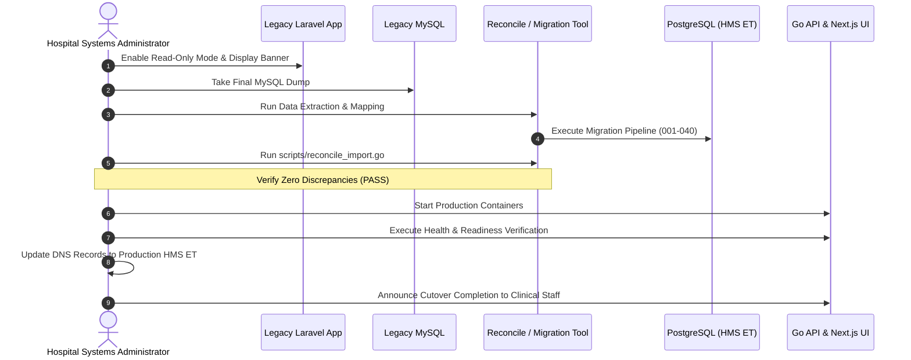

# User Acceptance, Migration Cutover, and Post-Release Playbook

## 1. User Acceptance Testing (UAT) Sign-Off Matrix

Before initiating production cutover, department leads must complete and sign off on key operational scenarios in the staging environment:

| Module / Department | Sign-Off Criteria | Responsible Lead | Status |
| :--- | :--- | :--- | :--- |
| **Front Office & Reception** | Patient registration, queue token allocation, appointment scheduling | Head Receptionist | [ ] Pending |
| **Outpatient (OPD)** | Patient triage, vital signs, diagnosis entry, consultation completion | Chief Medical Officer | [ ] Pending |
| **Inpatient (IPD) & Nursing** | Bed allocation, occupancy updates, nursing vital charts, discharge summaries | Nursing Supervisor | [ ] Pending |
| **Pharmacy & Blood Bank** | Prescription dispensing, stock batch deduction, blood unit issuing | Chief Pharmacist | [ ] Pending |
| **Laboratory & Diagnostics** | Diagnostic order placement, specimen entry, PDF report attachment upload | Lab Director | [ ] Pending |
| **Finance & Billing** | Invoice creation, anti-double-billing service link, cash/telebirr receipting | Head Accountant | [ ] Pending |

---

## 2. Maintenance Window Cutover Schedule

The production cutover is scheduled during the lowest activity window (e.g., Saturday 22:00 UTC to Sunday 02:00 UTC).

### Detailed Execution Steps
1. **T-60 min**: Notify all clinical departments and emergency units that cutover maintenance will begin.
2. **T-00 min**: Set legacy Laravel database to read-only mode (`SET GLOBAL read_only = ON;`).
3. **T+10 min**: Take final legacy MySQL snapshot and compute baseline row count / financial totals.
4. **T+20 min**: Execute migration script importing data into PostgreSQL target schema.
5. **T+45 min**: Run `go run scripts/reconcile_import.go` to verify row count parity, zero orphan records, and cent-exact financial balance parity.
6. **T+60 min**: Start HMS ET Docker containers and verify `/healthz`, `/readyz`, and `/metrics`.
7. **T+75 min**: Switch DNS A/AAAA records to point to production reverse proxy.
8. **T+90 min**: Conduct live end-to-end verification (test login for doctor, nurse, receptionist).

---

## 3. Rollback Rehearsal & Decision Matrix

### Abort Criteria
Cutover must be aborted and rolled back immediately if any of the following occur:
1. Automated reconciliation (`scripts/reconcile_import.go`) outputs `FAIL` and discrepancies cannot be resolved within 30 minutes.
2. Core database migrations fail to apply cleanly.
3. Critical patient safety workflows (e.g. emergency triage, blood bank lookups) fail smoke testing.

### Rollback Rehearsal Steps
1. Repoint DNS records back to legacy server IP.
2. Disable read-only mode on legacy MySQL (`SET GLOBAL read_only = OFF;`).
3. Verify legacy system is accepting transactions.
4. Send hospital-wide all-clear notice to clinical staff.

---

## 4. 24-Hour Post-Release Monitoring

Following cutover, the engineering on-call rotation actively monitors the production telemetry:
- **0 - 2 hours**: Intensive real-time log streaming (`docker logs -f hms-api`) inspecting for 5xx errors or unexpected input rejections.
- **2 - 12 hours**: Prometheus alert dashboard tracking HTTP latency p95, memory allocation stability, and database connection counts.
- **12 - 24 hours**: First shift change review with nursing and front-desk coordinators; reconciliation report audit on new transactions.
