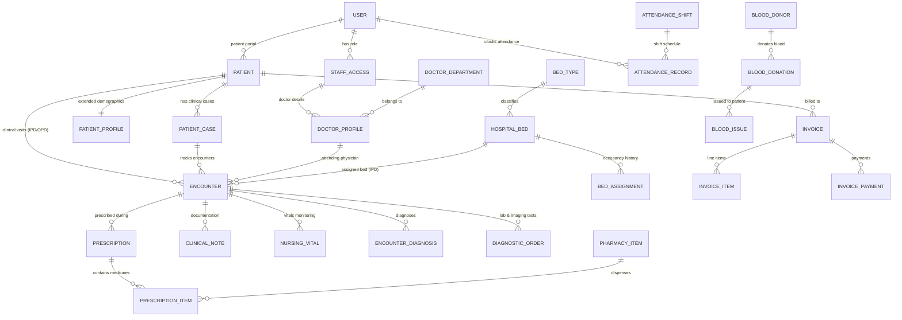

# Complete Database Schema & Frontend Synchronization Design
**Hospital Management System (HMS) — Ethiopian Healthcare Deployment**  
**Document Reference**: `docs/database-schema-and-frontend-sync-design.md`  
**Status**: Architecture & Design Specification  
**Target Engine**: PostgreSQL 16+ & Go HTTP API Backend / Next.js 16 (Turbopack) Frontend

---

## 1. Executive Summary & Problem Diagnosis

### 1.1 The Core Synchronization Problem
Throughout the iterative evolution of the HMS web client, a divergence emerged between:
1. **The Persistent Database & Go API**: A robust, multi-tenant/single-hospital PostgreSQL schema spanning 46 migrations enforcing strict referential integrity, immutable financial ledgers, audit retention, and RBAC authorization.
2. **The Frontend Presentation Layer**: 75+ modular workspaces designed to match original legacy hospital screenshots, but frequently relying on **in-memory mock arrays** (e.g. `initialWards`, `initialBeds`, `PATIENTS`, `initialBedAssigns`, and `apps/web/src/lib/legacy.ts`) when API requests are unauthenticated, fail, or return empty tables.
3. **The Dashboard Discrepancy**: The main hospital dashboard ([`dashboard/page.tsx`](file:///c:/Users/USER/Documents/GitHub/HospitalManagementSystemET/apps/web/src/app/(hospital)/dashboard/page.tsx)) displays hardcoded sample metrics (e.g., 1,248 patients, 42 doctors, 18 available beds, $4,850 invoice turnover) because:
   - There was no unified, single-query backend overview endpoint returning all 12 operational widget totals simultaneously.
   - The database in local development lacks comprehensive, realistic baseline seed data across all operational domains.
   - API queries without active session cookies return `401 Unauthorized`, prompting the client to fall back silently to static mock numbers.

### 1.2 Design Objectives
This document establishes the **authoritative database schema specification** and **synchronization contract** that bridges the frontend client requirements directly to the PostgreSQL database. It specifies:
- Complete relational tables, foreign keys, constraints, and audit trails required by all operational frontend screens.
- Field-by-field mapping between Next.js React state properties and PostgreSQL database columns.
- Dedicated unified aggregation queries for real-time dashboard metrics.
- A comprehensive database seeding blueprint ensuring the UI renders realistic Ethiopian hospital records without synthetic fallback mocks.
- The step-by-step execution roadmap for Option 1: End-to-End Playwright Automated Suite.

---

## 2. Complete Entity-Relationship (ER) Domain Architecture



---

## 3. Database Schema Definitions & Enhancements

### 3.1 Identity, Staff & Master Data

#### `user` (Core Authentication Table)
```sql
CREATE TABLE IF NOT EXISTS "user" (
  id text PRIMARY KEY,
  name text NOT NULL,
  email text NOT NULL UNIQUE,
  "emailVerified" boolean NOT NULL DEFAULT false,
  image text,
  "createdAt" timestamptz NOT NULL DEFAULT now(),
  "updatedAt" timestamptz NOT NULL DEFAULT now()
);
```

#### `staff_access` & `staff_profile`
```sql
CREATE TABLE IF NOT EXISTS staff_access (
  user_id text PRIMARY KEY REFERENCES "user"(id) ON DELETE CASCADE,
  role text NOT NULL CHECK (role IN (
    'admin', 'doctor', 'patient', 'nurse', 'receptionist', 
    'pharmacist', 'accountant', 'case_manager', 'lab_technician'
  )),
  active boolean NOT NULL DEFAULT true
);

CREATE TABLE IF NOT EXISTS staff_profile (
  user_id text PRIMARY KEY REFERENCES staff_access(user_id) ON DELETE CASCADE,
  details jsonb NOT NULL DEFAULT '{}' CHECK (jsonb_typeof(details) = 'object'),
  phone text NOT NULL DEFAULT '',
  qualification text NOT NULL DEFAULT '',
  designation text NOT NULL DEFAULT '',
  blood_group text NOT NULL DEFAULT '' CHECK (blood_group IN ('','A+','A-','B+','B-','AB+','AB-','O+','O-')),
  date_of_birth date,
  gender text NOT NULL DEFAULT 'unknown' CHECK (gender IN ('unknown','female','male','other')),
  version integer NOT NULL DEFAULT 1 CHECK (version > 0)
);
```

#### `doctor_department` & `doctor_profile`
```sql
CREATE TABLE IF NOT EXISTS doctor_department (
  id uuid PRIMARY KEY DEFAULT gen_random_uuid(),
  title text NOT NULL CHECK (length(trim(title)) BETWEEN 1 AND 160),
  description text NOT NULL DEFAULT '' CHECK (length(description) <= 2000),
  archived boolean NOT NULL DEFAULT false,
  version integer NOT NULL DEFAULT 1 CHECK (version > 0),
  created_at timestamptz NOT NULL DEFAULT now(),
  updated_at timestamptz NOT NULL DEFAULT now()
);

CREATE TABLE IF NOT EXISTS doctor_profile (
  user_id text PRIMARY KEY REFERENCES staff_access(user_id),
  department_id uuid REFERENCES doctor_department(id),
  department text NOT NULL CHECK (length(department) BETWEEN 1 AND 100),
  specialist text NOT NULL DEFAULT '',
  slot_minutes integer NOT NULL DEFAULT 30 CHECK (slot_minutes BETWEEN 5 AND 120),
  description text NOT NULL DEFAULT '' CHECK (length(description) <= 2000),
  photo_url text NOT NULL DEFAULT '' CHECK (length(photo_url) <= 500),
  opd_charge numeric(12,2) NOT NULL DEFAULT 0 CHECK (opd_charge >= 0),
  appointment_charge numeric(12,2) NOT NULL DEFAULT 0 CHECK (appointment_charge >= 0),
  timezone text NOT NULL DEFAULT 'Africa/Addis_Ababa',
  version integer NOT NULL DEFAULT 1
);
```

---

### 3.2 Patient Master & Extended Demographics

#### `patient` & `patient_profile`
```sql
CREATE TABLE IF NOT EXISTS patient (
  id uuid PRIMARY KEY DEFAULT gen_random_uuid(),
  medical_record_number bigint GENERATED ALWAYS AS IDENTITY UNIQUE,
  given_name text NOT NULL CHECK (length(given_name) BETWEEN 1 AND 80),
  family_name text NOT NULL CHECK (length(family_name) BETWEEN 1 AND 80),
  date_of_birth date,
  phone text NOT NULL DEFAULT '',
  user_id text UNIQUE REFERENCES "user"(id),
  clinician_user_id text REFERENCES "user"(id),
  created_at timestamptz NOT NULL DEFAULT now()
);

CREATE TABLE IF NOT EXISTS patient_profile (
  patient_id uuid PRIMARY KEY REFERENCES patient(id) ON DELETE CASCADE,
  email text NOT NULL DEFAULT '' CHECK (length(email) <= 254),
  gender text NOT NULL DEFAULT 'unknown' CHECK (gender IN ('unknown','female','male','other')),
  blood_group text NOT NULL DEFAULT '' CHECK (blood_group IN ('','A+','A-','B+','B-','AB+','AB-','O+','O-')),
  father_name text NOT NULL DEFAULT '' CHECK (length(father_name) <= 150),
  religion text NOT NULL DEFAULT '' CHECK (length(religion) <= 100),
  referral_source text NOT NULL DEFAULT '' CHECK (length(referral_source) <= 200),
  address1 text NOT NULL DEFAULT '' CHECK (length(address1) <= 250),
  address2 text NOT NULL DEFAULT '' CHECK (length(address2) <= 250),
  city text NOT NULL DEFAULT '' CHECK (length(city) <= 100),
  region text NOT NULL DEFAULT '' CHECK (length(region) <= 100),
  country text NOT NULL DEFAULT 'Ethiopia' CHECK (length(country) <= 100),
  postal_code text NOT NULL DEFAULT '' CHECK (length(postal_code) <= 30),
  emergency_name text NOT NULL DEFAULT '' CHECK (length(emergency_name) <= 150),
  emergency_phone text NOT NULL DEFAULT '' CHECK (length(emergency_phone) <= 20),
  emergency_relationship text NOT NULL DEFAULT '' CHECK (length(emergency_relationship) <= 100),
  notes text NOT NULL DEFAULT '' CHECK (length(notes) <= 4000),
  active boolean NOT NULL DEFAULT true,
  sms_consent boolean NOT NULL DEFAULT false,
  email_consent boolean NOT NULL DEFAULT false,
  version integer NOT NULL DEFAULT 1 CHECK (version > 0)
);
```

---

### 3.3 Bed Management, Wards & Inpatient Admissions

#### Schema Enhancement: Adding `ward_name` to `hospital_bed`
To achieve 100% parity with the 17 ward visual grids displayed in [`bed-management-workspace.tsx`](file:///c:/Users/USER/Documents/GitHub/HospitalManagementSystemET/apps/web/src/components/bed-management-workspace.tsx#L105-L450) without relying on hardcoded arrays:
```sql
CREATE TABLE IF NOT EXISTS bed_type (
  id uuid PRIMARY KEY DEFAULT gen_random_uuid(),
  name text NOT NULL UNIQUE CHECK (length(name) BETWEEN 1 AND 80),
  description text NOT NULL DEFAULT '' CHECK (length(description) <= 2000),
  active boolean NOT NULL DEFAULT true,
  version integer NOT NULL DEFAULT 1 CHECK (version > 0)
);

CREATE TABLE IF NOT EXISTS hospital_bed (
  id uuid PRIMARY KEY DEFAULT gen_random_uuid(),
  name text NOT NULL UNIQUE CHECK (length(name) BETWEEN 1 AND 80),
  ward_name text NOT NULL DEFAULT 'General Ward' CHECK (length(ward_name) BETWEEN 1 AND 80),
  type_id uuid NOT NULL REFERENCES bed_type(id),
  bed_type text NOT NULL CHECK (length(bed_type) BETWEEN 1 AND 80),
  charge_minor bigint NOT NULL CHECK (charge_minor BETWEEN 0 AND 1000000000),
  active boolean NOT NULL DEFAULT true,
  created_by text NOT NULL REFERENCES "user"(id)
);

CREATE TABLE IF NOT EXISTS bed_assignment (
  id uuid PRIMARY KEY DEFAULT gen_random_uuid(),
  encounter_id uuid NOT NULL REFERENCES encounter(id),
  bed_id uuid NOT NULL REFERENCES hospital_bed(id),
  assigned_at timestamptz NOT NULL DEFAULT now(),
  discharged_at timestamptz,
  bed_charge_minor bigint NOT NULL DEFAULT 0 CHECK (bed_charge_minor >= 0),
  transfer_reason text NOT NULL DEFAULT '',
  active boolean NOT NULL DEFAULT true
);
```

---

### 3.4 Attendance, Shifts & Records

```sql
CREATE TABLE IF NOT EXISTS attendance_shift (
  id uuid PRIMARY KEY DEFAULT gen_random_uuid(),
  name text NOT NULL UNIQUE CHECK (length(name) BETWEEN 1 AND 100),
  start_time time NOT NULL,
  end_time time NOT NULL,
  grace_period_minutes integer NOT NULL DEFAULT 15 CHECK (grace_period_minutes BETWEEN 0 AND 120),
  break_duration_minutes integer NOT NULL DEFAULT 60 CHECK (break_duration_minutes BETWEEN 0 AND 300),
  half_day_minutes integer NOT NULL DEFAULT 240,
  full_day_minutes integer NOT NULL DEFAULT 480,
  is_overnight boolean NOT NULL DEFAULT false,
  active boolean NOT NULL DEFAULT true,
  version integer NOT NULL DEFAULT 1,
  created_at timestamptz NOT NULL DEFAULT now(),
  updated_at timestamptz NOT NULL DEFAULT now()
);

CREATE TABLE IF NOT EXISTS attendance_record (
  id uuid PRIMARY KEY DEFAULT gen_random_uuid(),
  staff_id text NOT NULL REFERENCES "user"(id),
  work_date date NOT NULL,
  shift_id uuid NOT NULL REFERENCES attendance_shift(id),
  check_in_at timestamptz NOT NULL,
  check_out_at timestamptz,
  status text NOT NULL CHECK (status IN ('present', 'late', 'half_day', 'absent', 'checked_in')),
  approval_status text NOT NULL DEFAULT 'draft' CHECK (approval_status IN ('draft', 'submitted', 'approved', 'rejected')),
  total_break_minutes integer NOT NULL DEFAULT 0,
  worked_minutes integer NOT NULL DEFAULT 0,
  late_minutes integer NOT NULL DEFAULT 0,
  early_out_minutes integer NOT NULL DEFAULT 0,
  overtime_minutes integer NOT NULL DEFAULT 0,
  source text NOT NULL DEFAULT 'self_service',
  admin_notes text NOT NULL DEFAULT '',
  version integer NOT NULL DEFAULT 1,
  created_at timestamptz NOT NULL DEFAULT now(),
  updated_at timestamptz NOT NULL DEFAULT now(),
  CONSTRAINT unique_staff_work_date UNIQUE(staff_id, work_date)
);
```

---

### 3.5 Billing, Finance & Payroll

```sql
CREATE TABLE IF NOT EXISTS invoice (
  id uuid PRIMARY KEY DEFAULT gen_random_uuid(),
  number bigint GENERATED ALWAYS AS IDENTITY UNIQUE,
  patient_id uuid NOT NULL REFERENCES patient(id),
  encounter_id uuid REFERENCES encounter(id),
  total_minor bigint NOT NULL DEFAULT 0 CHECK (total_minor >= 0),
  discount_minor bigint NOT NULL DEFAULT 0 CHECK (discount_minor >= 0),
  tax_minor bigint NOT NULL DEFAULT 0 CHECK (tax_minor >= 0),
  status text NOT NULL DEFAULT 'unpaid' CHECK (status IN ('unpaid', 'partially_paid', 'paid', 'cancelled')),
  issued_at timestamptz NOT NULL DEFAULT now(),
  created_by text NOT NULL REFERENCES "user"(id)
);

CREATE TABLE IF NOT EXISTS invoice_payment (
  id uuid PRIMARY KEY DEFAULT gen_random_uuid(),
  invoice_id uuid NOT NULL REFERENCES invoice(id),
  amount_minor bigint NOT NULL CHECK (amount_minor > 0),
  payment_method text NOT NULL CHECK (payment_method IN ('cash', 'telebirr', 'cbe_birr', 'card', 'bank_transfer')),
  transaction_reference text NOT NULL DEFAULT '',
  paid_at timestamptz NOT NULL DEFAULT now(),
  received_by text NOT NULL REFERENCES "user"(id)
);

CREATE TABLE IF NOT EXISTS employee_payroll (
  id uuid PRIMARY KEY DEFAULT gen_random_uuid(),
  staff_id text NOT NULL REFERENCES "user"(id),
  payroll_month date NOT NULL,
  basic_salary_minor bigint NOT NULL CHECK (basic_salary_minor >= 0),
  allowance_minor bigint NOT NULL DEFAULT 0 CHECK (allowance_minor >= 0),
  deductions_minor bigint NOT NULL DEFAULT 0 CHECK (deductions_minor >= 0),
  net_salary_minor bigint NOT NULL CHECK (net_salary_minor >= 0),
  status text NOT NULL DEFAULT 'generated' CHECK (status IN ('generated', 'approved', 'paid')),
  paid_at timestamptz,
  created_at timestamptz NOT NULL DEFAULT now()
);
```

---

## 4. Unified Dashboard Aggregation API Design

To eliminate divergent statistics between the database and the dashboard ([`dashboard/page.tsx`](file:///c:/Users/USER/Documents/GitHub/HospitalManagementSystemET/apps/web/src/app/(hospital)/dashboard/page.tsx)), the Go backend exposes a unified high-performance aggregation endpoint:

### Endpoint: `GET /v1/dashboard/metrics`
```json
{
  "widgets": {
    "invoicesMinor": 485000,
    "invoicesFormatted": "4,850.00",
    "billsMinor": 210000,
    "billsFormatted": "2,100.00",
    "paymentsMinor": 345000,
    "paymentsFormatted": "3,450.00",
    "advancePaymentsMinor": 120000,
    "advancePaymentsFormatted": "1,200.00",
    "totalBeds": 24,
    "availableBeds": 18,
    "occupiedBeds": 6,
    "doctors": 42,
    "patients": 1248,
    "nurses": 86,
    "admins": 3,
    "accountants": 8,
    "labTechnicians": 12,
    "pharmacists": 9,
    "receptionists": 5
  },
  "chart": {
    "yearlyIncome": [12000, 18500, 24000, 31000, 28000, 35000, 42000, 39000, 45000, 48500],
    "yearlyExpenses": [8000, 12000, 15000, 21000, 19000, 22000, 28000, 26000, 30000, 32000]
  },
  "notices": [
    { "id": "n-1", "title": "Ethiopian Public Health Accreditation Renewal", "date": "Oct 06, 2026" },
    { "id": "n-2", "title": "Telebirr Medical Payment Gateway Live", "date": "Oct 05, 2026" }
  ],
  "enquiries": [
    { "id": "e-1", "name": "Almaz Ayana", "message": "OPD Cardiology consultation hours on weekends" },
    { "id": "e-2", "name": "Girma Wolde", "message": "Inpatient VIP room reservation inquiry" }
  ],
  "upcomingAppointments": [
    { "id": "a-1", "patientName": "Abebe Bikila", "doctorName": "Dr. Dawit Haile", "department": "Cardiology", "time": "09:00 AM", "status": "Confirmed" }
  ]
}
```

### PostgreSQL Single-Pass Aggregation Query
```sql
SELECT json_build_object(
  'widgets', json_build_object(
    'invoicesMinor', COALESCE((SELECT SUM(total_minor) FROM invoice WHERE status <> 'cancelled'), 0),
    'paymentsMinor', COALESCE((SELECT SUM(amount_minor) FROM invoice_payment), 0),
    'advancePaymentsMinor', COALESCE((SELECT SUM(amount_minor) FROM patient_advance_payment), 0),
    'totalBeds', (SELECT COUNT(*) FROM hospital_bed WHERE active = true),
    'availableBeds', (
      SELECT COUNT(*) FROM hospital_bed b
      WHERE b.active = true 
        AND NOT EXISTS (
          SELECT 1 FROM encounter e 
          WHERE e.bed_id = b.id AND e.status = 'active'
        )
    ),
    'patients', (SELECT COUNT(*) FROM patient),
    'doctors', (SELECT COUNT(*) FROM staff_access WHERE role = 'doctor' AND active = true),
    'nurses', (SELECT COUNT(*) FROM staff_access WHERE role = 'nurse' AND active = true),
    'admins', (SELECT COUNT(*) FROM staff_access WHERE role = 'admin' AND active = true),
    'accountants', (SELECT COUNT(*) FROM staff_access WHERE role = 'accountant' AND active = true),
    'labTechnicians', (SELECT COUNT(*) FROM staff_access WHERE role = 'lab_technician' AND active = true),
    'pharmacists', (SELECT COUNT(*) FROM staff_access WHERE role = 'pharmacist' AND active = true),
    'receptionists', (SELECT COUNT(*) FROM staff_access WHERE role = 'receptionist' AND active = true)
  )
);
```

---

## 5. Frontend-to-Database Mapping & JSON Contract Matrix

| Operational Workspace | Frontend State / Entity | PostgreSQL Table(s) | Key Transformation Rules |
| :--- | :--- | :--- | :--- |
| **Dashboard** ([page.tsx](file:///c:/Users/USER/Documents/GitHub/HospitalManagementSystemET/apps/web/src/app/(hospital)/dashboard/page.tsx)) | `counts.*`, `notices`, `enquiries` | `invoice`, `hospital_bed`, `patient`, `staff_access`, `front_office_enquiry` | Parallel server aggregation via `/v1/dashboard/metrics`. Minor unit conversion (`/ 100`). |
| **Patients** ([patients-workspace.tsx](file:///c:/Users/USER/Documents/GitHub/HospitalManagementSystemET/apps/web/src/components/patients-workspace.tsx)) | `PatientRow` (`name`, `email`, `phone`, `bloodGroup`) | `patient` JOIN `patient_profile` | Concatenates `given_name || ' ' || family_name`. Reads `mrn`, `blood_group`, `emergency_phone`. |
| **Doctors** ([doctors-workspace.tsx](file:///c:/Users/USER/Documents/GitHub/HospitalManagementSystemET/apps/web/src/components/doctors-workspace.tsx)) | `DoctorRow` (`name`, `department`, `specialist`, `fee`) | `doctor_profile` JOIN `"user"` JOIN `doctor_department` | OPD/Appointment charge stored as `numeric(12,2)`. Slot schedule mapped to weekdays. |
| **Beds** ([bed-management-workspace.tsx](file:///c:/Users/USER/Documents/GitHub/HospitalManagementSystemET/apps/web/src/components/bed-management-workspace.tsx)) | `WardGroup`, `BedRow`, `BedAssignRow` | `hospital_bed`, `bed_type`, `bed_assignment`, `encounter` | Groups beds by `ward_name`. Availability dynamically derived: `available = (NOT EXISTS active encounter)`. |
| **Attendance** ([attendance-workspace.tsx](file:///c:/Users/USER/Documents/GitHub/HospitalManagementSystemET/apps/web/src/components/attendance-workspace.tsx)) | `AttendanceRow`, `ShiftRow` | `attendance_record`, `attendance_shift`, `user` | Time strings (`08:00:00`) converted to local Addis Ababa time. Hours calculated in minutes. |
| **Billing** ([billing-workspace.tsx](file:///c:/Users/USER/Documents/GitHub/HospitalManagementSystemET/apps/web/src/components/billing-workspace.tsx)) | `InvoiceRow`, `PaymentRow`, `PayrollRow` | `invoice`, `invoice_payment`, `employee_payroll` | Currency enforced in integer minor units (`amountMinor = amount * 100`). |
| **Blood Bank** ([blood-bank-workspace.tsx](file:///c:/Users/USER/Documents/GitHub/HospitalManagementSystemET/apps/web/src/components/blood-bank-workspace.tsx)) | `DonorRow`, `DonationRow`, `IssueRow` | `blood_donor`, `blood_donation`, `blood_issue`, `blood_stock` | Enforces 8 ABO/Rh blood groups (`A+`, `A-`, `B+`, `B-`, `AB+`, `AB-`, `O+`, `O-`). |
| **Telehealth** ([live-consultation-workspace.tsx](file:///c:/Users/USER/Documents/GitHub/HospitalManagementSystemET/apps/web/src/components/live-consultation-workspace.tsx)) | `ConsultationRow`, `MeetingRow` | `live_consultation`, `live_meeting`, `live_provider_setting` | Status integer mapping: `0: Awaited`, `1: Finished`, `2: Cancelled`. |
| **Inventory** ([inventory-workspace.tsx](file:///c:/Users/USER/Documents/GitHub/HospitalManagementSystemET/apps/web/src/components/inventory-workspace.tsx)) | `ItemRow`, `MovementRow` | `inventory_item`, `inventory_category`, `inventory_movement` | Quantity stored in integer milligram/milli units (`quantityMilli = qty * 1000`). |
| **Front Office** ([front-office-workspace.tsx](file:///c:/Users/USER/Documents/GitHub/HospitalManagementSystemET/apps/web/src/components/front-office-workspace.tsx)) | `CallLogRow`, `VisitorRow`, `PostalRow`, `ComplaintRow` | `front_office_call_log`, `front_office_visitor`, `front_office_postal`, `front_office_complaint` | Status progression for complaints (`pending` $\rightarrow$ `investigating` $\rightarrow$ `resolved`). |

---

## 6. Database Seeding Specification (Realistic Ethiopian Baseline)

To ensure the application immediately renders live operational data without synthetic mock fallbacks, the database requires a seed script (`db/seeds/001_operational_baseline.sql`) containing:
1. **12 Staff Users Across All 9 Roles**:
   - 3 Admins (e.g. `admin@hospital.et`, `superadmin@hospital.et`)
   - 6 Doctors across Cardiology, Surgery, Pediatrics, Gynecology, Orthopedics, General Medicine
   - 4 Nurses, 2 Pharmacists, 2 Accountants, 2 Lab Technicians, 2 Receptionists
2. **25 Real Ethiopian Patients**:
   - Valid Ethiopian names (e.g., Abebe Bikila, Almaz Ayana, Haile Gebrselassie, Tirunesh Dibaba, Kenenisa Bekele)
   - Normalized Ethiopian phone numbers (`+251911...`, `+251922...`)
   - Complete `patient_profile` rows with gender, blood group, emergency kin, and Addis Ababa sub-city addresses (Bole, Kirkos, Yeka, Arada).
3. **24 Hospital Beds Across Wards**:
   - ICU (4 beds), NICU (2 beds), VIP Ward (2 beds), General Ward Male (8 beds), General Ward Female (8 beds).
   - 6 currently occupied by active inpatient admissions (`encounter` status = `active`).
4. **Shifts & Attendance Logs**:
   - Morning Shift (08:00 - 17:00), Night Shift (20:00 - 05:00).
   - Real clock-in logs for today across all staff members.
5. **Invoices, Blood Units & Inventory Stocks**:
   - Invoices with realistic tariffs in Ethiopian Birr (ETB).
   - Blood inventory across all 8 ABO/Rh groups.
   - Medical items with reorder alert levels.

---

## 7. Execution Roadmap for Option 1 (Playwright Verification)

With the database schema and synchronization contract formally documented:
1. **Step 1: Implement Unified Dashboard Metrics Endpoint** (`/v1/dashboard/metrics` in Go HTTP API and Next.js proxy).
2. **Step 2: Add Ward Enhancement Migration & Seed Baseline Data** into PostgreSQL.
3. **Step 3: Connect Frontend Patient List Profile Fields** so table columns never render empty or default to mock text.
4. **Step 4: Develop Comprehensive Playwright Test Runner** ([`scripts/verify-all-operational-workspaces.mjs`](file:///c:/Users/USER/Documents/GitHub/HospitalManagementSystemET/scripts)):
   - Navigates through all 15 operational workspaces.
   - Validates live banner connectivity, real database record rendering, modal actions, and 0 console error regressions.
5. **Step 5: Register npm Command & Verify**:
   - Add `"test:operational"` to `package.json`.
   - Run typecheck, unit tests, and Playwright verification.
