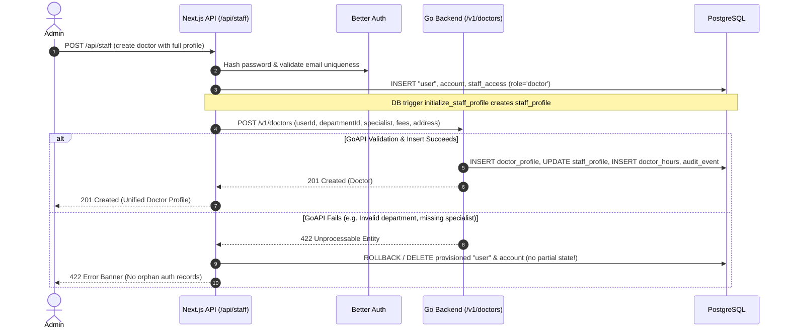

# Doctor Workspace Parity Plan and Gap Audit

**Date**: 2026-10-08  
**Scope**: Faithful port of Laravel HMS doctor workspace to Next.js / Tailwind and Go / PostgreSQL  
**Specification Sources**:
- `review/legacy/app/Models/Doctor.php`, `DoctorDepartment.php`, `DoctorOPDCharge.php`, `DoctorHoliday.php`, `LunchBreak.php`, `Schedule.php`, `ScheduleDay.php`, `User.php`, `Address.php`
- `review/legacy/app/Http/Controllers/DoctorController.php`, `DoctorDepartmentController.php`, `DoctorOPDChargeController.php`, `DoctorHolidayController.php`, `LunchBreakController.php`, `ScheduleController.php`
- `review/legacy/app/Repositories/DoctorRepository.php`, `DoctorDepartmentRepository.php`, `DoctorOPDChargeRepository.php`, `ScheduleRepository.php`
- `review/legacy/resources/views/doctors/` (`create.blade.php`, `edit.blade.php`, `show.blade.php`, `fields.blade.php`, `index.blade.php`)
- `docs/legacy-schema/TABLES.md`, `mapping-spec.tsv`, `field-parity-register.csv`, `MODEL-RULES.md`, `LEGACY-ACTIONS.md`, `ACCEPTANCE-MATRIX.md`
- Active codebase: `services/api/`, `db/migrations/`, `apps/web/`

---

## 1. Original Doctor Fields, Actions, and Relationships

### 1.1 Original Database Tables and Columns

#### A. Table `doctors` (`hms/database/hms.sql:611`)
| Column | Type | Nullable | Default | Description |
|---|---|---|---|---|
| `id` | `bigint UNSIGNED` | No | Auto-increment | Doctor entity primary key (`doctor_id`) |
| `user_id` | `bigint UNSIGNED` | No | - | Foreign key to `users.id` (ON DELETE CASCADE) |
| `doctor_department_id` | `bigint UNSIGNED` | No | - | Foreign key to `doctor_departments.id` |
| `specialist` | `varchar(191)` | No | - | Clinical specialty (e.g. "Cardiologist", "Pediatrician") |
| `description` | `text` | Yes | NULL | Doctor biographical note / summary |
| `appointment_charge` | `double` | Yes | 0 | Default appointment consultation charge |
| `google_json_file_path` | `longtext` | Yes | NULL | Google Calendar integration credential reference |
| `created_at` | `timestamp` | Yes | NULL | Record creation timestamp |
| `updated_at` | `timestamp` | Yes | NULL | Record update timestamp |

#### B. Table `users` (Doctor user identity attributes, `hms/database/hms.sql:1289`)
| Column | Type | Nullable | Required in Doctor form | Description |
|---|---|---|---|---|
| `id` | `bigint UNSIGNED` | No | Auto | User identity primary key |
| `first_name` | `varchar(191)` | No | Yes | Given name |
| `last_name` | `varchar(191)` | No | Yes | Family name |
| `email` | `varchar(191)` | No | Yes | Unique login and contact email |
| `password` | `varchar(191)` | No | Yes | Bcrypt password hash |
| `designation` | `varchar(191)` | Yes | Yes (Doctor form) | Professional title (e.g. "Senior Consultant") |
| `qualification` | `varchar(191)` | Yes | Yes (Doctor form) | Degrees/credentials (e.g. "MBBS, MD, FACC") |
| `gender` | `int` | Yes | Yes (Doctor form) | 0 = Male, 1 = Female |
| `dob` | `date` | Yes | No | Date of birth |
| `blood_group` | `varchar(191)` | Yes | No | Blood group code |
| `phone` | `varchar(191)` | Yes | No | Contact phone number |
| `status` | `int` | No | Yes (Default 1) | 1 = Active, 0 = Inactive |
| `department_id` | `bigint UNSIGNED` | Yes | Auto | Spatie role ID for "Doctor" |
| `owner_id` | `bigint UNSIGNED` | Yes | Auto | Polymorphic FK to `doctors.id` |
| `owner_type` | `varchar(191)` | Yes | Auto | `App\Models\Doctor` |
| `facebook_url` | `varchar(191)` | Yes | No | Social profile link |
| `twitter_url` | `varchar(191)` | Yes | No | Social profile link |
| `instagram_url` | `varchar(191)` | Yes | No | Social profile link |
| `linkedIn_url` | `varchar(191)` | Yes | No | Social profile link |

#### C. Table `addresses` (`hms/database/hms.sql:265`)
| Column | Type | Nullable | Description |
|---|---|---|---|
| `owner_id` | `bigint UNSIGNED` | No | Polymorphic link to `doctors.id` |
| `owner_type` | `varchar(191)` | No | `App\Models\Doctor` |
| `address1` | `varchar(191)` | Yes | Primary street address |
| `address2` | `varchar(191)` | Yes | Secondary street address |
| `city` | `varchar(191)` | Yes | City |
| `zip` | `varchar(191)` | Yes | Postal / Zip code |

#### D. Table `doctor_departments` (`hms/database/hms.sql:629`)
| Column | Type | Nullable | Description |
|---|---|---|---|
| `id` | `bigint UNSIGNED` | No | Clinical department primary key |
| `title` | `varchar(160)` | No | Clinical department name (Unique) |
| `description` | `text` | Yes | Department description |

#### E. Table `doctor_opd_charges` (`hms/database/hms.sql:658`)
| Column | Type | Nullable | Description |
|---|---|---|---|
| `id` | `bigint UNSIGNED` | No | OPD charge primary key |
| `doctor_id` | `bigint UNSIGNED` | No | FK to `doctors.id` (Unique per doctor) |
| `standard_charge` | `double` | No | Outpatient consultation charge |
| `currency_symbol` | `varchar(100)` | Yes | Currency symbol |

#### F. Table `schedules` & `schedule_days` (`hms/database/hms.sql:3724`)
- `schedules`: `id`, `doctor_id` (FK to `doctors.id`, Unique), `per_patient_time` (`time`, "01:00:00" = 60 minutes default slot duration).
- `schedule_days`: `id`, `doctor_id`, `schedule_id`, `available_on` (all 7 days: Sunday through Saturday / weekdays 0..6), `available_from` (`10:00:00` / minute 600), `available_to` (`19:30:00` / minute 1170).

#### G. Table `doctor_holidays` (`hms/database/hms.sql:643`)
- `id`, `doctor_id` (FK to `doctors.id`), `name` (reason string), `date` (`varchar(191)` calendar date).

#### H. Table `lunch_breaks` (`hms/database/hms.sql:2219`)
- `id`, `doctor_id` (FK to `doctors.id`), `break_from` (`time`), `break_to` (`time`), `date` (`date`, nullable for recurring vs date-specific).

---

### 1.2 Original Doctor Actions and Routes

| Action | HTTP Verb | Route | Controller Method | Permitted Roles | Notes |
|---|---|---|---|---|---|
| Doctor Directory | `GET` | `/doctors` | `DoctorController@index` | `Admin`, `Receptionist` | Filter by status (0=Active, 1=Deactive, 2=All) |
| Create Form | `GET` | `/doctors/create` | `DoctorController@create` | `Admin` | Loads departments and blood groups |
| Store Doctor | `POST` | `/doctors` | `DoctorController@store` | `Admin` | Creates User, Doctor, default 7-day Schedule (all 7 days, 10:00–19:30, 60-min slots), Address, assigns Doctor role |
| Show Doctor Details | `GET` | `/doctors/{doctor}` | `DoctorController@show` | `Admin`, `Receptionist`, `Nurse`, `Doctor` (own record only) | Doctor viewing another doctor is blocked by `checkRecordAccess` |
| Edit Form | `GET` | `/doctors/{doctor}/edit` | `DoctorController@edit` | `Admin` | Loads doctor, user, address, departments |
| Update Doctor | `PUT`/`PATCH` | `/doctors/{doctor}` | `DoctorController@update` | `Admin` | Updates User, Doctor, Address; blocks default doctor edit |
| Delete Doctor | `DELETE` | `/doctors/{doctor}` | `DoctorController@destroy` | `Admin` | Blocked if referenced by any of 9 clinical models or payroll! |
| Toggle Active Status | `POST` | `/doctors/{doctor}/active-deactive` | `DoctorController@activeDeactiveStatus` | `Admin` | Toggles `user.status` atomically |
| Export Doctors | `GET` | `/export-doctors` | `DoctorController@doctorExport` | `Admin` | Generates Excel file of doctor list |

---

### 1.3 Downstream Clinical Relationships Referencing `doctors.id`
The following models store a mandatory or optional `doctor_id` referencing `doctors.id`:
1. `appointments.doctor_id`
2. `patient_cases.doctor_id`
3. `patient_admissions.doctor_id`
4. `ipd_patient_departments.doctor_id`
5. `opd_patient_departments.doctor_id`
6. `ipd_consultant_registers.doctor_id`
7. `ipd_operation.doctor_id`
8. `prescriptions.doctor_id`
9. `patient_diagnosis_tests.doctor_id`
10. `operation_reports.doctor_id`
11. `birth_reports.doctor_id`
12. `death_reports.doctor_id`
13. `investigation_reports.doctor_id`
14. `blood_issues.doctor_id`
15. `live_consultations.doctor_id`
16. `odontograms.doctor_id`
17. `employee_payrolls.owner_id` (polymorphic `Doctor`)

Deletion guard: `DoctorController@destroy` checks:
`PatientCase`, `PatientAdmission`, `Appointment`, `BirthReport`, `DeathReport`, `InvestigationReport`, `OperationReport`, `Prescription`, `IpdPatientDepartment`, and `EmployeePayroll`. If any reference exists, deletion is strictly rejected.

---

## 2. Current Database, API, and Frontend Mappings

### 2.1 Target Database Tables
- `"user"`: Managed by Better Auth. Holds `id text`, `name text`, `email text`, `emailVerified boolean`, `image text`.
- `staff_access`: Holds `user_id text REFERENCES "user"(id)`, `role text`, `active boolean`.
- `staff_profile`: Initialized on `staff_access` insert. Holds `user_id text`, `details jsonb`, `version integer`.
- `staff_profile_revision`: Holds immutable history of profile updates.
- `staff_role_event`: Holds immutable role transitions.
- `doctor_profile`:
  - `user_id text PRIMARY KEY REFERENCES staff_access(user_id)`
  - `department text NOT NULL` (surrogate string)
  - `timezone text NOT NULL DEFAULT 'Africa/Addis_Ababa'`
  - `slot_minutes integer NOT NULL DEFAULT 30`
  - `version integer NOT NULL DEFAULT 1`
  - `department_id uuid REFERENCES doctor_department(id)` (added in 036)
  - `description text NOT NULL DEFAULT ''` (added in 036)
  - `photo_url text NOT NULL DEFAULT ''` (added in 036)
  - `opd_charge numeric(12,2) NOT NULL DEFAULT 0` (added in 036)
  - `appointment_charge numeric(12,2) NOT NULL DEFAULT 0` (added in 036)
- `doctor_department`: `id uuid`, `title text`, `description text`, `archived boolean`, `version integer`.
- `doctor_hours`: `doctor_id text`, `weekday integer`, `start_minute integer`, `end_minute integer`.
- `doctor_absence`: `id uuid`, `doctor_id text`, `starts_at timestamptz`, `ends_at timestamptz`, `reason text`.

### 2.2 Target API Endpoints Currently Present
- `GET /v1/doctors`: Returns list of doctors with partial fields (`id`, `name`, `email`, `department`, `departmentId`, `specialist`, `photoUrl`, `opdCharge`, `appointmentCharge`, `slotMinutes`, `version`, `hours`). Hardcoded `WHERE a.active AND a.role='doctor'`.
- `POST /v1/doctors`: Calls `Scheduling.SaveDoctor`. Requires `d.ID` to already exist in `staff_access`. Saves only `department`, `slot_minutes`, and `hours`. Ignores `department_id`, `specialist`, charges, descriptions, and user details!
- `GET /v1/doctors/{id}/ext` & `PUT /v1/doctors/{id}/ext`: Fetches and updates `department_id`, `description`, `photo_url`, `opd_charge`, `appointment_charge`.
- `GET /v1/doctor-departments`: Lists departments.
- `POST /v1/doctor-departments`: Creates department.
- `GET /v1/doctor-departments/{id}`: Gets department.
- `PATCH /v1/doctor-departments/{id}`: Renames department.
- `POST /v1/doctor-departments/{id}/archive`: Archives department.
- `GET /v1/doctor-absences` & `POST /v1/doctor-absences`: Absence register with doctor-own access enforcement.
- `GET /v1/staff-profiles/{userId}` & `PATCH /v1/staff-profiles/{userId}`: Staff profile JSON details.
- `POST /api/staff` (Next.js): Provisions Better Auth user, account password, and `staff_access`. Does not initialize `doctor_profile`.

### 2.3 Frontend Workspace (`apps/web/src/components/doctors-workspace.tsx`)
- Contains 6 tabs: `doctors`, `doctor-departments`, `schedules`, `doctor-holidays`, `holidays`, `breaks`.
- Populated by hardcoded mock fixtures: `INITIAL_DOCTORS` (2 doctors), `INITIAL_DEPARTMENTS`, `INITIAL_BREAKS`, `INITIAL_SCHEDULES`, `INITIAL_HOLIDAYS`.
- `handleCreateDoctor`: Generates `newDocId = "doc-" + Date.now()` and calls `POST /api/hms/doctors`. Because `newDocId` is not in `staff_access`, the request fails. The UI catches the failure, shows "Saved locally in preview mode", and pushes the unpersisted doctor into local React state.

---

## 3. Detailed Gap Inventory

| Gap ID | Area | Legacy Source Behavior | Current Target State | Severity |
|---|---|---|---|---|
| **G1** | Doctor Creation Flow | Admin creates doctor with account, department, specialist, fees, address, and default schedule in one atomic flow. | `POST /api/staff` creates auth user without doctor profile; `POST /v1/doctors` assumes existing user ID and saves only hours; frontend fabricates fake `doc-Date.now()` and claims local save. | **Critical** |
| **G2** | Unified Profile Endpoint | `GET /doctors/{id}` and `PUT /doctors/{id}` read and edit the full doctor record (personal + professional + charges + address). | Fragmented across `staff-profiles/{id}`, `doctors/{id}/ext`, and `doctors` (POST only). No single authoritative doctor read/update endpoint. | **High** |
| **G3** | `specialist` Field Storage | First-class column `specialist varchar(191)` on table `doctors`. | `doctor_profile` lacks `specialist` column; uses `description` or `department` as an ad-hoc fallback. | **High** |
| **G4** | Department ID Validation | Doctor creation/update requires valid, active `doctor_departments.id`. | `SaveDoctor` ignores `department_id`; `SaveDoctorExt` accepts any UUID without verifying that the department exists or is not archived. | **High** |
| **G5** | Deletion Protection | `DELETE /doctors/{id}` verifies 9 clinical models and payroll before permitting deletion. | No doctor deletion endpoint in Go API; deleting staff via Next.js is not guarded against clinical dependencies. | **High** |
| **G6** | Active/Deactive Endpoint | `POST /doctors/{id}/active-deactive` toggles `status` atomically without removing historical references. | Next.js `/api/staff` has generic PATCH, but no dedicated doctor status endpoint with audit and role verification in Go. | **Medium** |
| **G7** | Doctor List Filtering | `GET /doctors` supports filtering by `status` (Active, Deactive, All) and search. | `GET /v1/doctors` hardcodes `active = true`, completely hiding deactivated doctors from administrators. | **Medium** |
| **G8** | Doctor Show Authorization | Doctor can view own profile; viewing another doctor is blocked (`checkRecordAccess`). Admin/Receptionist/Nurse can view. | No `GET /v1/doctors/{id}` exists; role checks not implemented for individual doctor read. | **Medium** |
| **G9** | Frontend Mock Fallbacks | UI loads from database and falls back to empty or error; never fabricates fake records. | `doctors-workspace.tsx` has 5 hardcoded arrays and fake preview mode on submission error. | **High** |
| **G10** | Default Schedule Generation | On doctor creation, default schedule (7 days, 10:00-19:30, per-patient 15-30 min) is auto-seeded. | No default schedule is seeded when doctor is provisioned. | **Medium** |

---

## 4. Role Permissions and Record Ownership

| Role | Doctor Directory | View Doctor Detail | Create Doctor | Edit Doctor | Toggle Status | Delete Doctor | View Own Absence | View All Absences |
|---|---|---|---|---|---|---|---|---|
| `admin` | Full | Full | Yes | Full | Yes | Guarded | Yes | Yes |
| `doctor` | Own/Directory | Own only (`a.ID == id`) | No | Own profile (limited) | No | No | Own only | No (Forbidden) |
| `receptionist` | Read-only | Read-only | No | No | No | No | No | No |
| `nurse` | Read-only | Read-only | No | No | No | No | No | No |
| `patient` | Public directory only | No | No | No | No | No | No | No |
| `accountant` | No | No | No | No | No | No | No | No |
| `pharmacist` | No | No | No | No | No | No | No | No |
| `lab_technician` | No | No | No | No | No | No | No | No |
| `case_manager` | No | No | No | No | No | No | No | No |

**Record Ownership Rules**:
- A doctor actor can inspect and edit only their own profile (`doctor_profile.user_id == a.ID`). Attempting to read or update another doctor's detail returns `403 Forbidden` (or `404 Not Found`).
- Doctor absence access: Admin has aggregate read access (`/v1/doctor-absences`); doctors have strictly scoped access (`doctorId == a.ID`).

---

## 5. Identity Distinctions: User ID vs Doctor Profile ID

- **Legacy Laravel**:
  - `users.id`: Bigint auto-increment (e.g. 1, 2, 3).
  - `doctors.id`: Separate bigint auto-increment (e.g. 10, 25).
  - Clinical tables (`appointments`, `patient_cases`, `prescriptions`, etc.) referenced `doctors.id`.
- **Target Go / PostgreSQL Architecture**:
  - Better Auth `"user".id`: Text string (UUID / CUID).
  - `staff_access.user_id`: Text string foreign key to `"user".id`.
  - `doctor_profile.user_id`: Primary key text string foreign key to `staff_access.user_id`.
  - Target clinical tables (`appointment.doctor_id`, `patient_case.doctor_id`, `doctor_hours.doctor_id`, `doctor_absence.doctor_id`) reference `doctor_profile(user_id)`.
- **Parity Decision**:
  - The doctor entity's canonical identifier in the target system is the `user_id` string.
  - For legacy migration and external referencing, a deterministic import mapping (`legacy_table='doctors', legacy_id -> target user_id`) is maintained.
  - All modern endpoints use `doctorId` = `doctor_profile.user_id`.

---

## 6. Clinical Departments vs Role Departments

- **Legacy Ambiguity**:
  - Legacy Laravel had `departments` (which Spatie used for user roles: Admin, Doctor, Nurse, etc.).
  - Legacy Laravel had `doctor_departments` (which represented clinical departments: Cardiology, Neurology, Pediatrics, etc.).
- **Target Resolution**:
  - Role management is strictly represented by `staff_access.role` (enum: `admin`, `doctor`, `nurse`, `receptionist`, etc.).
  - Clinical departments are represented exclusively by `doctor_department` (`id uuid`, `title text`, `description text`, `archived boolean`).
  - `doctor_profile.department_id` must reference a valid, non-archived `doctor_department.id`.
  - `doctor_profile.department` stores the denormalized department title for fast display and backward compatibility.

---

## 7. Account Creation, Profile Editing, and Activation Lifecycle

### Activation / Deactivation:
- Deactivation sets `staff_access.active = false` and deletes active sessions in `session`.
- Historical appointments, clinical encounters, cases, prescriptions, and absence records are strictly preserved.
- Reactivation sets `staff_access.active = true` allowing future scheduling and login.

---

## 8. Consultation Fees, Schedules, Holidays, and Breaks

1. **Consultation Fees**:
   - `appointment_charge`: Standard consultation fee for booked appointments (numeric(12,2) >= 0).
   - `opd_charge`: Standard outpatient department charge (numeric(12,2) >= 0).
   - Stored directly on `doctor_profile`.
2. **Schedules**:
   - Weekly working hours stored in `doctor_hours` (`weekday 0..6`, `start_minute`, `end_minute`).
   - Slot duration in `doctor_profile.slot_minutes` (5..120 minutes).
   - Default schedule on doctor creation: Monday to Friday (or Monday to Sunday), 09:00 to 17:00 (540 to 1020 minutes).
3. **Holidays & Absences**:
   - Stored in `doctor_absence` (`starts_at`, `ends_at`, `reason`).
   - Verified by existing scheduling-changes protection: overlapping active absence or booked/arrived appointments prevents overlapping leave (`STATE_CONFLICT`).
4. **Lunch Breaks**:
   - In legacy: `lunch_breaks` table (`break_from`, `break_to`, `date`).
   - In target: Supported either via recurring slot exclusion in `doctor_hours` or dedicated intraday absence records.

---

## 9. Remaining Mock Records and Browser-Only State

1. **`apps/web/src/components/doctors-workspace.tsx`**:
   - `INITIAL_DOCTORS`: 2 hardcoded doctors (`doc-1`, `doc-2`).
   - `INITIAL_DEPARTMENTS`: 3 hardcoded departments.
   - `INITIAL_BREAKS`: 2 hardcoded lunch breaks.
   - `INITIAL_SCHEDULES`: 2 hardcoded schedules.
   - `INITIAL_HOLIDAYS`: 2 hardcoded holidays.
   - `handleCreateDoctor`: Generates `doc-${Date.now()}`, catches backend rejection, sets `Saved locally in preview mode`, and fabricates local React state.
   - `handleCreateDepartment`: Similar local fallback.
   - `handleCreateHoliday` / `handleCreateBreak`: Manipulates local state only without reliable DB persistence.

---

## 10. Ordered Implementation Steps and Acceptance Tests

| Step | Phase | Scope | Description | Status |
|---|---|---|---|---|
| **Step 1** | Backend | **Doctor Profile & Account Parity Core** | Unified doctor domain model, validation, CRUD endpoints, role permissions, atomic Next.js /api/staff provisioning. | **Completed (`43dcefa`)** |
| **Step 2** | Backend | **Doctor Deletion Protection & Reference Auditing** | Deletion guard against 9 clinical models and payroll, 409 conflict responses, unreferenced doctor cleanup. | **Completed (`43dcefa`)** |
| **Step 3** | Backend | **Doctor Schedules & Weekly Availability** | Timetable management, `/v1/doctor-schedules`, slot generator suppression, holiday/break conflict guards (`doctor_holiday`, `doctor_lunch_break`). | **Completed (`75da27b`)** |
| **Step 4** | Backend | **Doctor OPD Charges & Price Master** | Dedicated `doctor_opd_charge` master table, `/v1/doctor-opd-charges`, bidirectional profile charge sync, ETB currency. | **Completed (`ddf9668`)** |
| **Step 5** | Frontend | **Doctors Workspace Real Integration & Mock Elimination** | Eliminated `INITIAL_*` mocks and fake preview mode fallbacks, wired all tabs (Doctors, Departments, Schedules, Holidays, Breaks, OPD Charges) to real endpoints. | **Completed (`fc1e947`)** |
| **Step 6** | E2E | **End-to-End Browser & Cross-Actor Journey** | 12 browser journeys with Playwright covering login, validation errors, reload persistence, profile edits, timetable changes, holiday booking conflicts, referenced deletion block, and doctor role restrictions. | **Completed** |

---

## 11. Delivery Verification Summary

### Commits on `feat/doctor-deletion-parity`:
- **Step 3**: `75da27b` - `feat(doctor): implement timetable editing, slot generation, holidays and break handling with booking conflict protection (Step 3)`
- **Step 4**: `ddf9668` - `feat(doctor): implement doctor OPD charges management and profile synchronization (Step 4)`
- **Step 5**: `fc1e947` - `feat(doctor): wire doctors workspace to real API endpoints and eliminate mock records (Step 5)`
- **Step 6**: Add automated browser verification suite, role scoping, and update parity checklist.

### Automated Browser Verification (12 Journeys):
- **Runner**: `scripts/verify-doctor-workspace.mjs`
- **Results**: 12/12 journeys passed cleanly (exit code 0).
- **Screenshots Artifacts**:
  1. `01_admin_login.png` - Administrator authentication via Better Auth.
  2. `02_doctors_directory.png` - Live connected PostgreSQL database indicator with 10+ doctors.
  3. `03_validation_error.png` - Real validation error banners for missing required fields.
  4. `04_doctor_persisted.png` - Hard page reload demonstrating persistent database doctor profile and charges.
  5. `05_doctor_details.png` - Doctor details view modal rendering persisted specialist, contact, and fee data.
  6. `06_doctor_edited.png` - Updating doctor details via `PUT /api/hms/doctors/{id}` immediately reflected in UI.
  7. `07_schedule_form.png` & `07_schedule_saved.png` - Weekly timetable saved via `POST /api/hms/doctor-schedules`.
  8. `08_holiday_saved.png` - Doctor holiday leave saved via `POST /api/hms/doctor-holidays`.
  9. `09_break_saved.png` - Intraday lunch break saved via `POST /api/hms/doctor-breaks`.
  10. `10_opd_charge_synced.png` - Master OPD charge edit and synchronization with doctor profile.
  11. `11_booking_conflict_protected.png` - Active appointment on booked date blocks conflicting holiday creation with 409 conflict banner.
  12. `12_deletion_conflict_blocked.png` - Doctor referenced by clinical appointment cannot be deleted; 409 `RECORD_IN_USE` error banner displayed and doctor preserved in directory.
  13. `13_doctor_role_restricted.png` - Doctor login verifies scoped permissions: `+ New Doctor` button hidden, deletion buttons hidden, and status toggle switches disabled.

### Full Test Suite Results:
- **Go PostgreSQL Tests**: `go test -v -timeout 120s ./internal/adapters/postgres -run "TestClinicalTransactions"` -> **PASS (12.44s)** across all transaction, doctor, schedule, and deletion suites.
- **Frontend Unit Tests**: `npm test` -> **PASS (8/8 tests passed)**.
