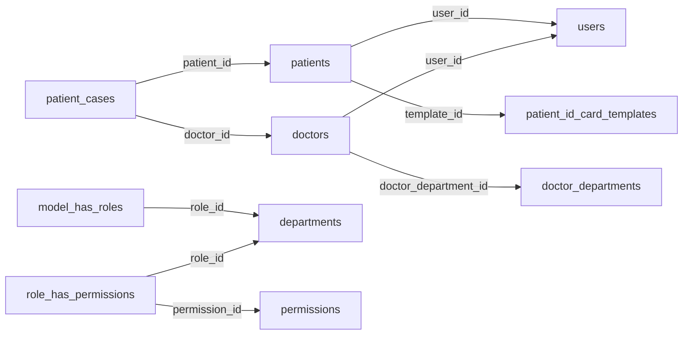
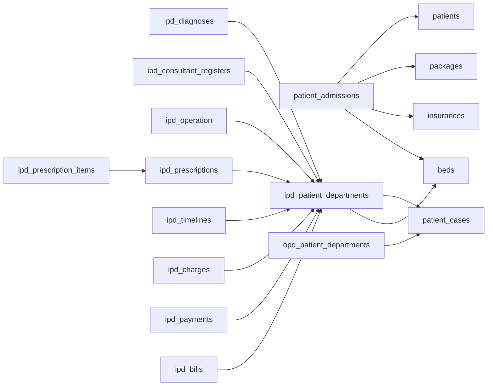

# Original HMS database reconstruction and backend parity plan

Audit date: 2026-10-06. Target: single-hospital Next.js/Go/PostgreSQL system.

## Decision

Use the original database **and its application contracts** as the feature reference. Preserve every in-scope field, relationship, business identifier, editable form, detail tab and transaction. Keep PostgreSQL, Better Auth and the Go architecture. Do not replace the current database with an unreviewed MySQL import or assume that similarly named tables are interchangeable.

The supplied ZIP makes a complete table/column inventory possible. It also shows that the current backend schema is not yet a complete counterpart to the original. Matching frontend appearance does not establish persistence or workflow parity. This audit changes documentation and adds reproducible analysis tooling; it does not change application code, apply migrations, import records or certify frontend completion.

## Evidence and how to use it

| Artifact | Contents |
| --- | --- |
| [TABLES.md](TABLES.md) | All 141 original tables; all 1,202 column definitions; original keys, indexes, auto-increment and FK actions; associated model relations |
| [original-mysql-schema.sql](original-mysql-schema.sql) | Extracted CREATE/ALTER statements only; no inserted hospital records; evidence, not a target migration |
| [foreign-keys.csv](foreign-keys.csv) | All 144 database foreign keys, including referenced columns and delete/update actions |
| [MIGRATIONS.md](MIGRATIONS.md) | Structural operations from all 275 app migrations in chronological filename order; seeder references without seed values |
| [migration-reconciliation.json](migration-reconciliation.json) | Column-name reconciliation of migration operations against dump; unresolved coverage explicitly listed |
| [inventory.json](inventory.json) | Machine-readable DDL, migrations, 130 models, 207 model relationship calls, model casts/validation/constants, 468 workflow source indexes, release DDL and current PostgreSQL migration definitions |
| [POSTGRES-MAPPING.md](POSTGRES-MAPPING.md) | Every original table mapped once to candidate PostgreSQL storage or an explicit gap/exclusion |
| [field-parity-register.csv](field-parity-register.csv) | All 1,202 source fields, original definition and candidate target tables; target column, API/UI and QA columns deliberately pending until verified |
| [mapping-spec.tsv](mapping-spec.tsv) | Curated input to regenerate the table mapping |

The inventory is exhaustive for the ZIP dump's structural objects extracted here. The workflow file index is a navigation aid, **not a claim that all 468 implementations have been manually reviewed**. This pass deeply checked identity/roles, patient/card templates, IPD/OPD, billing, diagnosis reports, odontograms and selected catalog relations. Other workflows require the implementation-level checks below.

Reproduce from repository root:

```powershell
python scripts/audit-legacy-schema.py 'C:/Users/USER/Downloads/Telegram Desktop/hms.zip'
```

The extractor never executes PHP or SQL and does not export INSERT statements, `.env` files or user records. It resolves the archive's configured permission table names. It verifies complete one-to-one source-table coverage in the mapping and verifies every FK source/target column exists. Preserve manually completed field-register work before regenerating: the generated CSV is a baseline and regeneration overwrites it. Copy it to a working implementation register first.

## Source versions and limits

- ZIP dump: `hms/database/hms.sql`, generated **2026-04-29 12:29**, MySQL **8.3.0**; database label `hms-saas`. That label does not mean the new single-hospital app needs tenancy.
- Latest app migration filename in this ZIP: `2026_04_20_114626_run_email_template_seeder.php`.
- 18 release SQL files are indexed separately. They are historic upgrade evidence, not a second set of migrations to apply after the full dump.
- No paths containing attendance, shift or leave_request were found under the ZIP's `app`, `database` or `resources/views` trees. The live demo's attendance module is a newer reference and remains a separate design source. No claim is made about its hidden database.
- Current checked-in PostgreSQL source: **48 migrations creating 143 tables**. Similar table counts do not mean matching capabilities. No live database was queried or modified in this pass; checked-in migration state is distinct from applied database state.
- MySQL dump and migration **column names** reconcile for the application tables after resolving permission configuration, Laravel implicit columns and the password table rename. Dump-only tables: `migrations`, `subscriptions`, `subscription_items`. Dump-only columns on `users`: `pm_type`, `pm_last_four`, `trial_ends_at`. These are framework/Cashier-related differences; do not invent missing business modules from them.
- This reconciliation does not prove every type, default, data migration or conditional upgrade path is equivalent. Exact dump definitions and original migration operations are both retained for those checks.

## Original design: identity and master data

The original has a central `users` table for identity/demographics and separate doctor/patient/staff-role rows linked by `user_id`. Clinical `patients.id` and `doctors.id` are **not** their user IDs. Many clinical tables reference these role-table IDs. Our patient UUID and staff user-text IDs require explicit mapping.

`departments` is particularly easy to misread: `config/permission.php` maps Spatie's **roles** to `departments`; `Department` implements `RoleContract`. `doctor_departments` is the clinical department catalog. They must remain distinct concepts.

Original role membership and permission pivots are `model_has_roles`, `model_has_permissions` and `role_has_permissions`, with `permissions` as master. Our `staff_access` and Go permissions are a different representation. Validate all nine role workspaces, multiple-role/per-user-permission behavior where used, and patient ownership. Merely migrating the role label is insufficient.

Polymorphic relationships occur in addresses (`owner_type/owner_id`), users' owners, media (`model_type/model_id`), employee payroll and medicine bills. These have no ordinary FK that proves their target. Class-name strings need a controlled model-to-target map during import.



Arrows summarize original reference direction, not mandatory cardinality or a claim of uniqueness on child columns. Exact FK evidence is in the CSV.

## Original design: patients, admission and encounters

There are **three distinct registration concepts**:

1. `patient_cases`: case number, patient, doctor, date, charge/status.
2. `patient_admissions`: admission number/date/discharge, doctor/bed, package, insurance/policy/agent and guardian details. Standalone bill records also carry `patient_admission_id` even though the dump does not enforce an FK on that column.
3. `ipd_patient_departments` and `opd_patient_departments`: encounter registers with their own business numbers and dedicated detail-tab child tables.

IPD adds admission date, bed/type, discharge and bill flags. OPD adds appointment date, standard charge and payment mode. Both have patient, doctor, case, height/weight/BP, symptoms, notes, old-patient flag and custom-field values. The original OPD schema permits a null case. Our core encounter requires a case with a composite patient/doctor FK; preserve the original user flow by a deliberate backend contract, not by sending arbitrary IDs or forcing a new visible required field.



The OPD equivalent has its own diagnoses, timelines, prescription headers/items. A shared Go aggregate is fine if it can reconstruct every original list/form/detail response and retain encounter-specific authorization.

Important detail-tab contracts:

| Original workflow | Data that must survive the new design |
| --- | --- |
| Diagnosis tab | report type/date/description and associated media; not interchangeable with an ICD code/category/status diagnosis |
| Consultant instruction | doctor, instruction, applied date and instruction date; not only care-team membership |
| Operation | reference, category/master operation, operation date, doctor, two assistant consultants, anesthetist/anesthesia, OT technician/assistant, remark/result |
| Prescription | header/footer note, grouped items with category/medicine/dosage/interval/day/instruction/time; meal/duration UI choices must map to actual item fields |
| Timeline | title, date, description, media and `visible_to_person`; patient visibility is independent of staff visibility |
| Charges | charge category/master, date, standard vs applied amount; retain price at time of care |
| Payments | encounter, date/method/amount/notes and receipt media where used; preserve payments before final bill |
| Bill/discharge | itemized charges/payments, discount/tax/other charges, calculated totals, bed release and clinical discharge as a consistent transaction |

## Original design: finance and stock

Do not collapse all money tables into `invoice_payment`:

- `invoices` + `invoice_items`: account-based patient invoices.
- `bills` + `bill_items`: standalone/admission bills with item-name/quantity/price/amount and payment state.
- `ipd_bills`, `ipd_charges`, `ipd_payments`: encounter settlement.
- `advanced_payments`: patient advance receipts, independently numbered.
- `payments`: `account_id`, **pay_to**, date/amount/description. These are not inherently patient invoice receipts.
- `transactions`, `bill_transactions`, `appointment_transactions`: provider transaction families with different parent contexts.
- `expenses`, `incomes`, `employee_payrolls`: operational finance and payroll.
- `medicine_bills` + `sale_medicines`: pharmacy sales; `purchase_medicines` + `purchased_medicines`: purchase headers and batch/lot lines; `used_medicines`: consumption.

Original money fields often use `double`. Keep target monetary amounts as integer minor units with explicit currency and rounding, or a deliberate exact-decimal representation. Import conversion must be specified per field, including negative/refund/discount semantics. Do not convert currency symbols into assumed currency codes silently.

`IpdBillRepository::getBillList` currently calculates tax on `(charges - payments)`, discount on charges, adds one bed charge and other charges, then subtracts payments and discount. `saveBill` accepts bill input and updates discharge/bed availability, including deleting an assignment in one path. Preserve the visible workflow; document the formula decision, compute server-side and keep bed history. Do not copy unsafe client totals or destructive historical deletion as requirements.

Catalogs and reusable relationships matter:

- `packages` → `package_services` → `services`.
- `insurances` → `insurance_diseases`.
- medicine category/brand/catalog → purchases/stock/usage/sales.
- `item_categories` → `items` → `item_stocks` and `issued_items` (including staff owner, issued/return dates and status).
- blood donor → donation → issue, with blood group and bag/charge accounting.

An immutable ledger is a good target, but must retain original editable draft operations and grouped document IDs; a stock movement alone cannot replace an entire purchase form.

## Original design: diagnostics, cards and dental charts

Pathology/radiology test catalogs are distinct from general patient diagnosis reports. `pathology_parameters` and `pathology_parameter_items` associate tests and parameter definitions; the latter also contains `patient_result`. `patient_diagnosis_tests` holds patient/doctor/category/report number and `patient_diagnosis_properties` holds report property-name/value rows. A generic template table is not the stored report.

Smart cards use a dedicated `patient_id_card_templates` entity: name, color and six booleans (`email`, `phone`, `dob`, `blood_group`, `address`, `patient_unique_id`). Patients reference the template. Our current card's `template_name` does not preserve this CRUD. Keep secure token-based card access, while adding editable templates and a well-defined issued-card snapshot policy.

`odontograms` stores a **chart record** with patient, doctor, description and JSON tooth state. `OdontogramController` creates/edits/deletes/prints by chart ID; repository creation permits multiple charts for one patient. Our `patient_odontogram_entry` uses `UNIQUE(patient_id,tooth_number)` and an upsert, which loses that chart-level identity/history. Add a chart parent with tooth-state children or versioned JSON; retain multiple chart records, original condition codes, doctor/description and print output. Do not guess clinical code mappings from color alone.

## Confirmed high-priority gaps and semantic conflicts

These are findings from checked-in DDL/source, not a claim that all other features work.

| Priority | Gap | Required direction |
| --- | --- | --- |
| P0 | Chart-level odontogram CRUD vs current per-patient/tooth overwrite | Add chart aggregate/history, exact tooth-code representation and ID-based CRUD/print |
| P0 | Smart-card template master absent | Add template entity, fields/toggles, patient/card relation, constraints and CRUD |
| P0 | IPD/OPD child tabs have differently shaped target entities | Define per-tab field contracts; add missing instruction/report/timeline/prescription/operation data |
| P0 | Three original billing families and outgoing payments vs combined target ledger | Preserve document kinds/business IDs, bill/payment lifecycles and authoritative totals |
| P0 | Admission package/insurance masters missing | Add catalog/line relations; preserve pricing snapshots and guardian/agent/policy fields |
| P1 | Pharmacy purchase document headers/lines absent as dedicated entities | Add purchase/line/payment-state contracts around batch stock movements |
| P1 | General diagnosis report/property records not explicitly represented | Add report aggregate/values and source-compatible print/edit workflow |
| P1 | Document type/register vs generic binary attachment storage | Add metadata/classification contracts and secured owner-aware retrieval |
| P1 | Notification inbox vs message delivery outbox | Add recipient/read/type/meta/deep-link semantics independently of retries |
| P1 | Email templates and currency master CRUD not dedicated tables | Add typed/versioned catalog representation or documented equivalent preserving every UI field |
| P1 | Advance receipt table exists but API evidence is only dashboard sum in this audit | Implement/verify receipt create/read/history/print and immutable allocation/reversal semantics |
| P1 | Google Calendar per-user integration/event identity not represented | Implement explicit credential references and sync tables if keeping the original integration UI |
| P1 | Original role/permission pivots vs fixed target roles | Prove effective permissions/workspace scope; implement needed editable grants without weakening checks |
| Separate | Attendance absent from this ZIP | Complete from live-demo forms and current Go schema; do not invent an original ZIP schema |

Examples of current source evidence: `db/migrations/037_patient_extensions_queues_appointments.sql` (card), `038_clinical_care_bed_management.sql` (chart, encounter children/admission/billing), `039_diagnostics_vaccinations_vital_reports.sql` (diagnosis template), `047_bed_ward_enhancement.sql` (advance receipt), and `services/api/internal/adapters/postgres/clinical_care.go` (tooth upsert). All 141 table mappings, including less prominent CMS/front-office/report/provider modules, are in POSTGRES-MAPPING.md.

## Constraints to preserve or deliberately improve

- The dump contains 144 FKs: 133 delete-and-update cascades, six delete-only cascades, three delete-set-null/update cascades and two with no explicit action. Copying these wholesale would risk erasing clinical/financial history. Define restrict/archive/void policies for target business records while preserving the intended UI outcome.
- `password_reset_tokens` has no primary key in the dump; Better Auth replaces that framework implementation rather than inheriting it.
- `users` has no DB FK for its polymorphic owner; addresses/media and several finance tables also rely partly on application relations. A column ending in `_id` is not proof of a foreign key.
- `complaints.patient_id` references **users.id**, despite its name. Map through the original user-to-patient relation; never cast directly into a patient UUID.
- Business identifiers (`patient_unique_id`, IPD/OPD numbers, invoice/bill/purchase/report/receipt numbers) must remain separate from internal IDs. Preserve legacy values and allocate future numbers atomically.
- Nullable source values, original numeric enums, soft deletes and custom-field JSON need explicit transforms. Constants/casts/rules are captured in inventory.json; schema alone does not explain enum meanings.
- Store instants with explicit timezone conversion; old MySQL datetimes carry no timezone. Confirm source timezone before importing dates. Date-only fields and local schedule times must not be shifted as UTC timestamps.
- Preserve empty strings vs null only where they have business meaning. Normalize malformed/double-encoded chart/custom-field JSON with recorded errors rather than silently dropping it.
- Uploaded media must map by owner/collection to protected storage and authenticated downloads; keep hash/size/MIME metadata and attachments linked to the actual workflow.

## Proposed implementation order

### 1. Freeze the parity contract before new migrations

- [x] Extract every source table, column, FK and index from the dump.
- [x] Index all app migrations and model relationships/validation/constants.
- [x] Reconcile column-name coverage and document framework differences.
- [x] Assign every original table to candidate target storage or an explicit missing/out-of-scope decision.
- [ ] Copy field-parity-register.csv to a working contract; complete target column/transform, API field and original form/detail/print reference for each in-scope field.
- [ ] Verify types/defaults/enum values and conditional migrations for the fields being migrated.
- [ ] Trace each original screen action through routes → request validation → controller → repository → models → tables/media; classify create/update/delete/transition/print/search/export.
- [ ] Record live-demo-only additions separately (especially attendance) and explicitly decide Cashier/add-on/calendar scope.

### 2. Add backward-compatible PostgreSQL migrations

- [ ] Review applied schema and backup before migration; do not assume migration 048 is deployed merely because it is committed.
- [ ] Add card-template and chart-level odontogram aggregates first; backfill existing card/chart records without discarding them.
- [ ] Add package/insurance catalogs and preserve their admission references/snapshots.
- [ ] Add missing IPD/OPD instruction/report/timeline/operation/prescription semantics; keep generic clinical features where useful.
- [ ] Reconcile finance document kinds, discounts/tax/currency, advances and payments; introduce explicit document/line relations where the ledger cannot express original grouped CRUD.
- [ ] Add pharmacy purchase headers/lines, diagnosis reports/properties, document taxonomy, notifications/templates and remaining agreed masters.
- [ ] Define FK, unique, check, index, optimistic-locking and idempotency rules for each new aggregate; test existing-data backfills.

### 3. Complete Go contracts and frontend persistence

- [ ] Implement aggregate repositories/use cases, server validation and transactions; adapt response shapes to original forms.
- [ ] Implement lookups scoped to active permitted patients/doctors/masters; enforce patient/case/doctor/bed relationships on the server.
- [ ] Connect each original action to real endpoint behavior; keep forms open on errors, show empty states on no data and reject silent local success.
- [ ] Preserve filtered list order, pagination, detail tabs, modal vs page navigation, dependent dropdowns, upload/download and print UX.
- [ ] Keep authentication with Better Auth/Firebase; operational SMS and email use outbox/providers. External credential placeholders remain blank.
- [ ] Reconcile list/dashboard/print totals against persisted transactions rather than fixture values.

### 4. Import and validate if legacy data is to be migrated

- [ ] Add an import mapping `(source_system, source_table, source_id) → target_id` with unique constraints and a resumable batch manifest.
- [ ] Import master data/identity, role profiles, patients, catalogs, cases/admissions/encounters, child records, then financial/stock ledgers and media metadata.
- [ ] Convert polymorphic references explicitly and retain original business identifiers. Do not import login sessions, reset tokens, API keys or provider OAuth tokens as ordinary hospital data.
- [ ] Quarantine invalid/orphan/duplicate rows; report counts and reasons; never silently invent missing clinical owners or amounts.
- [ ] Reconcile counts, sums by currency, balances, stock, occupied beds and attachments. Original source data was not exported or imported by this audit.

### 5. Acceptance tests per module

- [ ] Migration tests: fresh schema plus upgrade from existing schema; backfill preservation; constraints/indexes and clean failure on invalid data.
- [ ] API tests: create/read/update/archive or void; missing/invalid fields; wrong patient/role; duplicate keys; stale updates; concurrent writes; pagination/search/filter.
- [ ] Workflow tests: admission/bed transfer/discharge, each IPD/OPD tab, multi-chart dental records, smart-card toggles, provider callback retries, medication purchase/issue/return and billing/advance reconciliation.
- [ ] Browser tests: fill the original form, save, reload, reopen edit, confirm the same values; validate server errors/empty results and actual database persistence.
- [ ] Print/download tests: same data/totals/identity as detail view, correct attachment access and patient-visible flags.
- [ ] Nine-role journeys: administrative and patient-owned views, forbidden direct URLs/APIs, export/print scoping.
- [ ] Update the delivery checklist only with test evidence, commit each verified slice, and document remaining gaps honestly.

Completion gate: every in-scope legacy field and workflow has a target contract and passing persistence/authorization test, or an explicit documented scope decision. A matching screenshot, matching table count, generated CSV or passing page-load test does not satisfy that gate.
