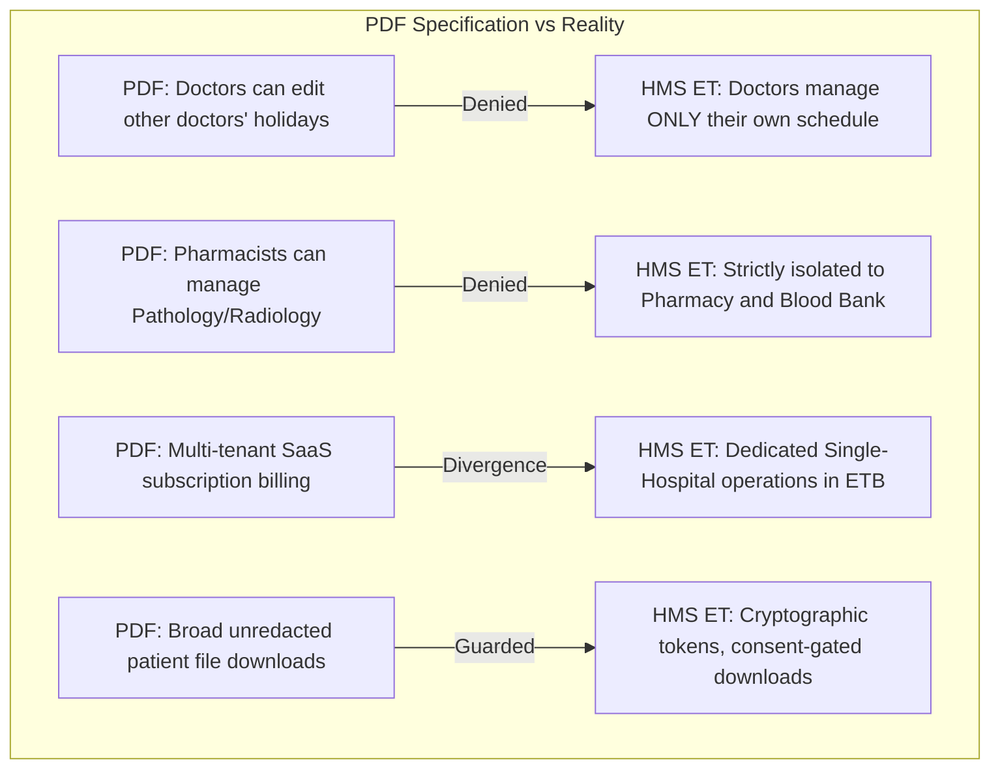

# Legacy Source Parity, Domain Contracts, and Workflow Specifications

## 1. Executive Summary & Review Scope

This specification documents the exhaustive structural audit of the legacy Laravel/Blade hospital platform (`review/legacy`) and the accompanying specification (`ULSHMS Saas.pdf`, v1.0). It establishes the definitive domain contracts, lifecycle state machines, field requirements, role permissions, and intentional modernizations in the Go clean-architecture backend.

### 1.1 Live Reference Status & Offline Authoritative Analysis
- **Live Reference URLs**: External demo URLs (`smart-hospital-in.info`, etc.) timed out consistently across multiple testing attempts due to upstream hosting unreachability.
- **Authoritative Ground Truth**: All data structures, business rules, and UI requirements are rigorously extracted directly from the original authored codebase (`review/legacy`: 162 controllers, 130 models, 275 migrations, 5 route files) and the 40-page product specification.

---

## 2. Inactive vs. Active Legacy Routes & Modules

A critical finding from the source audit is that legacy `routes/web.php` and `routes/api.php` contain legacy experiments, stubs, and disabled features that must not be blindly replicated:

| Module / Route | Legacy Status | Audit Finding | New System Treatment |
| :--- | :--- | :--- | :--- |
| `// Route::get('paystack-payment-success', ...)` | Commented out (lines 657, 684, 1329) | Unconfigured, incomplete Paystack webhook stubs | Excluded; replaced by structured Stripe adapter and local cash/CBE/Telebirr workflows |
| `/users/creates` | Inactive stub (line 135) | Returns temporary Blade view `users.new_create` | Excluded; replaced by administrator user provisioning API |
| `AddonController` (`/addons`) | Third-party plugin uploader | High security risk (arbitrary zip extraction) | Excluded; all features are compiled and statically verified |
| `SmsTemplateController` | Partial implementation | Unused text template placeholders | Replaced by durable, structured outbox with parameterized templates |
| `live.consultation` / Zoom integration | Active in code | Relied on deprecated Zoom JWT auth | Modernized with OAuth token / external meeting URL link architecture |

---

## 3. Reconciliation: PDF Role Descriptions vs. Implemented Permissions

The 40-page PDF and the legacy Laravel Spatie permission seeds contain notable contradictions. The new system reconciles them under the principle of **least privilege and clinical safety**:

### Documented Contradictions & Enforced Resolutions:
1. **Doctor Schedule Boundaries**: The PDF stated doctors could add/edit holidays for other doctors. In HMS ET, a doctor can only view or manage their own absences; only `admin` has facility-wide schedule override privileges.
2. **Diagnostic Cross-Contamination**: The PDF granted pharmacists pathology and radiology test management rights. In HMS ET, diagnostic tests and reports are strictly partitioned to `doctor` and `lab_technician` roles.
3. **Patient Observation Privacy**: In legacy code, clinical notes and vitals had inconsistent patient-facing visibility. In HMS ET, an explicit `patient_visible` boolean flag controls patient portal release.

---

## 4. Workflow Specifications: Field Contracts, Lifecycles, and Side Effects

### 4.1 Outpatient (OPD) & Inpatient (IPD) Clinical Care
- **Lifecycle States**:
  - OPD: `active` $\rightarrow$ `completed` $\rightarrow$ `referred`
  - IPD: `admitted` $\rightarrow$ `transferred` $\rightarrow$ `discharged`
- **Side Effects**:
  - Inpatient discharge requires complete financial clearance via `encounter_billing` linked to `service_invoice_link`.
  - Bed release is atomic with admission discharge.
- **Field Constraints**:
  - `patient_id` (UUID, Required, Foreign Key to `patient.id`)
  - `department` (Enum: `OPD`, `IPD`, `Emergency`, `Dental`, `ICU`)
  - `admitted_at` (UTC timestamp, Required)
  - `discharge_summary` (Structured markdown or JSON: clinical course, discharge condition, medications, follow-up date)

### 4.2 Appointments & Queue Allocation
- **Lifecycle States**: `scheduled` $\rightarrow$ `confirmed` $\rightarrow$ `in_queue` $\rightarrow$ `completed` / `cancelled` / `no_show`
- **Side Effects**:
  - Queue check-in atomically increments daily token counter (`COALESCE(MAX(token_number), 0) + 1`).
  - Cancellation requires an audited cancellation reason and releases the doctor slot.
  - Linked appointment billing records anti-double-billing hash in `service_invoice_link`.

### 4.3 Pharmacy Dispensing & Blood Bank Inventory
- **Dispensing Rule**:
  - Transactional deduction from specific stock batches (`pharmacy_batch`).
  - Zero negative stock allowed (`CHECK (current_quantity >= 0)`).
  - Medication order marked `partially_dispensed` or `dispensed`.
- **Blood Bank Rule**:
  - 8 standard ABO/Rh groups (`A+`, `A-`, `B+`, `B-`, `AB+`, `AB-`, `O+`, `O-`).
  - Strict bag status progression: `donated` $\rightarrow$ `screened` $\rightarrow$ `available` $\rightarrow$ `issued` / `expired`.

### 4.4 Financial Invoicing & Ledger Protection
- **Immutability Contract**:
  - Once issued, invoice headers and line items cannot be mutated or deleted.
  - Amendments require explicit credit notes, refunds, or supplementary line items.
  - Anti-double-billing constraint: `UNIQUE(source_type, source_id)` on `service_invoice_link`.

---

## 5. Stable API Error Codes & Contract Mapping

All API endpoints strictly communicate error states via uniform JSON structures with stable machine-parsable error codes:

| HTTP Status | Stable Code | Semantic Meaning |
| :--- | :--- | :--- |
| `401 Unauthorized` | `UNAUTHENTICATED` | Missing or invalid session cookie |
| `403 Forbidden` | `FORBIDDEN` | Caller lacks the role or ownership rights for the record |
| `404 Not Found` | `NOT_FOUND` | Target entity does not exist |
| `409 Conflict` | `IDEMPOTENCY_CONFLICT` | Same idempotency key re-used with mismatched request payload |
| `409 Conflict` | `STATE_CONFLICT` | Concurrency version mismatch (record updated by another actor) |
| `422 Unprocessable` | `VALIDATION_FAILED` | Input fields violate bounds, formats, or business constraints |
| `503 Unavailable` | `DEPENDENCY_UNAVAILABLE` | External service (database, payment provider, SMTP) is offline |
| `500 Server Error` | `INTERNAL_ERROR` | Unexpected server failure; sensitive traces redacted |
